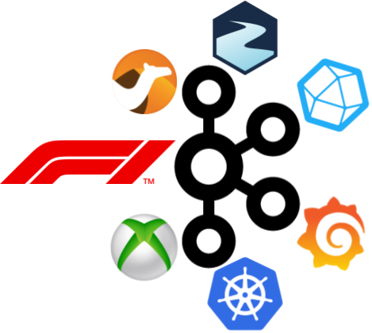
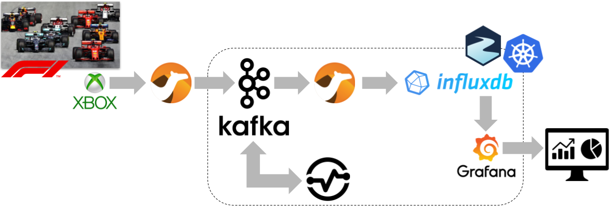
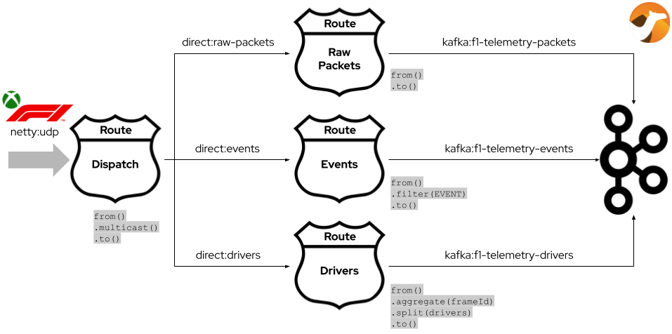
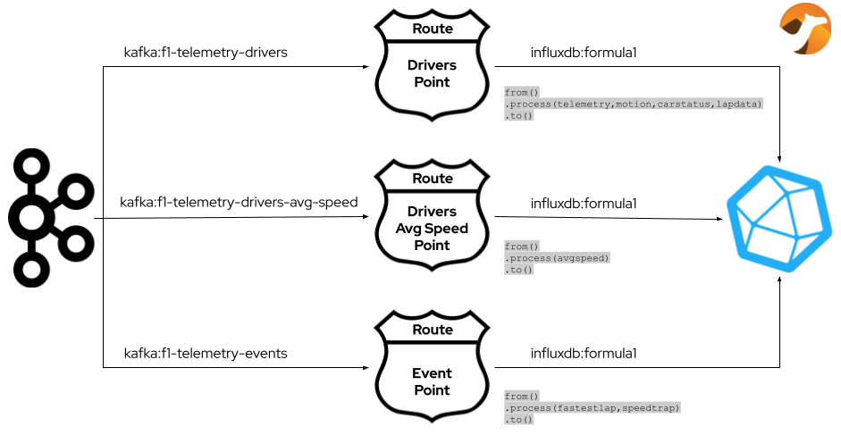
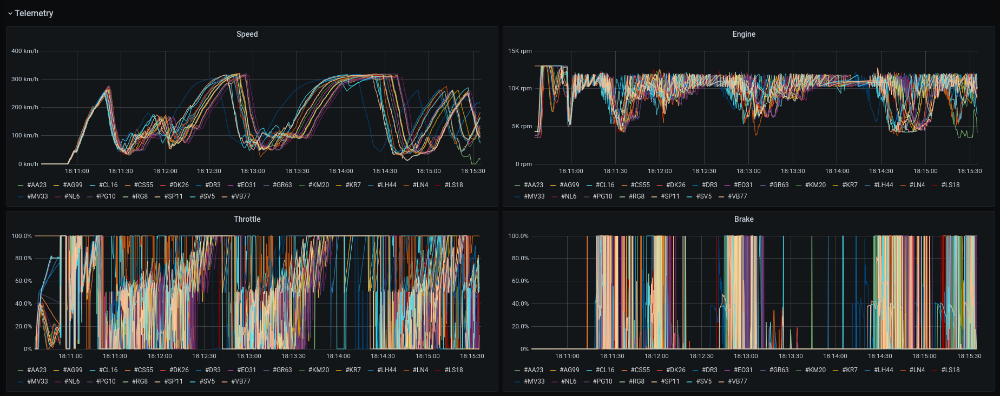
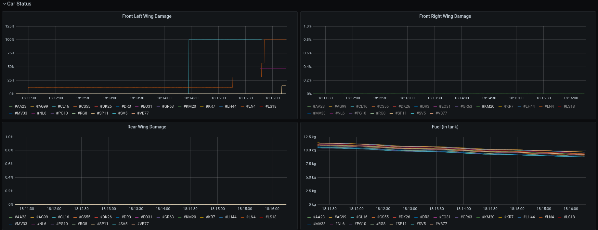
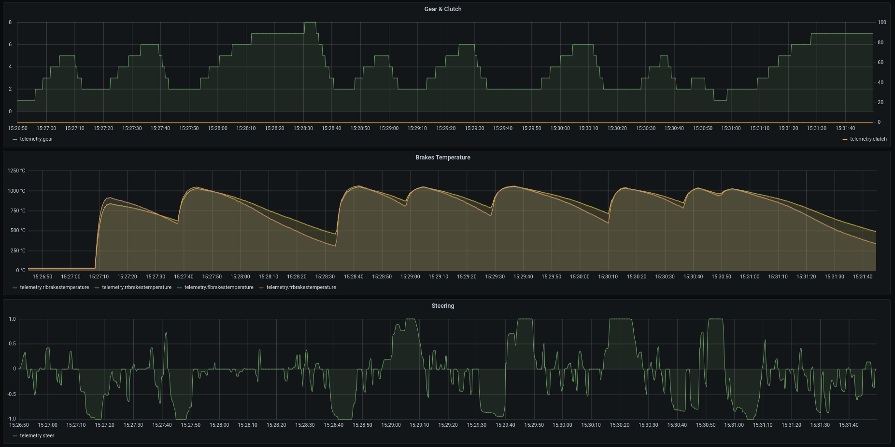

# Formula 1 - Telemetry with Apache Kafka

This project aims to use Apache Kafka in order to ingest Formula 1 telemetry data from the F1 2020 game (by CodeMasters) running on Microsoft Xbox.
It uses different products, projects and technologies:

* **[F1 2020 game (by CodeMasters)](https://www.codemasters.com/game/f1-2020/)** for getting the telemetry data via UDP;
* **[Apache Camel](https://camel.apache.org/)** project for routing telemetry events from UDP to Apache Kafka and to InfluxDB;
* **[Apache Kafka](https://kafka.apache.org/)** as the core project for ingesting the telemetry events on different topics;
* **[Kubernetes](https://kubernetes.io/)** for deploying most of the components to run in the cloud;
* **[Strimzi](https://strimzi.io/)** for deploying easily the Apache Kafka on Kubernetes;
* **[InfluxDB](https://www.influxdata.com/)** for storing the telemetry time series as data source for dashboards;
* **[Grafana](https://grafana.com/)** for providing dashboards showing the real time telemetry data;  



## Overview

Following an overall picture of how these technologies are used together.
A short introduction video is available [here](https://youtu.be/Re9LOAYZi2A). 



### F1 2020 Xbox UDP to Kafka

In order to ingest the telemetry events into Apache Kafka, the Apache Camel project is used with:

* a route getting the raw UDP packets from the F1 2020 game (by CodeMasters) on Microsoft Xbox and dispatching these events to three more routes;
    * a route just forwarding the raw UDP packets to a corresponding Apache Kafka topic;
    * a route to filter only the `EVENT` type raw UDP packets and forwarding them to a corresponding Apache Kafka topic;
    * a route to aggregate the raw UDP packets data for producing drivers related data and forwarding them to a corresponding Apache Kafka topic;



### Kafka to InfluxDB

In order to provide the telemetry data to Grafana dashboards, InfluxDB is used as data source and the telemetry events are stored through Apache Camel with:

* a route getting drivers related data for storing telemetry, motion and car status data;
* a route getting the `EVENT` type raw UDP packets for storing fastest lap and speedtrap events;



## Repository structure

Contains different components for ingesting and handling Formula 1 2020 game (by CodeMasters) telemetry data through Apache Kafka.

* **f1-telemetry-udp-kafka**: Apache Camel application bridging the telemetry packets got on UDP from the Formula 1 2020 game to Apache Kafka to different topics:
    * _f1-telemetry-packets_ contains the raw `Packet`(s);
    * _f1-telemetry-events_ contains only the raw `Packet`(s) of `EVENT` type;
    * _f1-telemetry-drivers_ contains the `Driver` messages as result of aggregating `Packet`(s) in the same frame with telemetry data for all drivers;
* **f1-telemetry-consumer**: Apache Kafka client application consuming `Driver` messages from Apache Kafka;
* **f1-telemetry-streams**: Apache Kafka Streams API based application getting raw `Packet`(s) and processing in real time;
* **f1-telemetry-common**: common library providing model classes and related Apache Kafka serializer/deserializer;
* **f1-telemetry-kafka-influxdb**: Apache Camel application writing driver/car's telemetry data  to InfluxDB as time series; 
* **f1-telemetry-webui**: A sample Web application showing the race ranking in real time getting `Driver`(s) from Apache Kafka;
* **dashboard**: folder containing Grafana dashboard showing driver/car's telemetry data;
* **deployment**: folder containing Kubernetes deployments for all the provided applications;

The Formula 1 2020 game UDP packets specification is [here](https://forums.codemasters.com/topic/50942-f1-2020-udp-specification/).
The library used for decoding the packets is [here](https://github.com/ppatierno/formula1-telemetry).

## Dashboards

The telemetry dashboard shows information like speed, engine (rpm), throttle and brake.



The motion dashboard shows information about the car in motion like the G-force.


The car status dashboard shows information mostly related to the status of each car, for example wings damages and fuel in tank.



The events dashboard shows race events like max speed trap and fastest lap.


The driver dashboard allows to get data for a single driver, selecting one through the corresponding drop down list. 
It has a top bar with information about current lap, position, distance and lap times.


It also has some graphs showing specific driver data related to throttle/brake, engine/speed, gear/clutch, brakes and steering.




It also shows specific information about tyres as damage, wear and surface temperature.


## Build

In order to build all the components, just run the following command.

```shell
mvn package
```

If you want to run the applications as containers even locally or on Kubernetes, a [Google Jib](https://github.com/GoogleContainerTools/jib) configuration is available for building the corresponding Docker images.

```shell
mvn package jib:dockerBuild
```

The above command will build the Docker images locally; you have to push them to the registry you prefer manually.